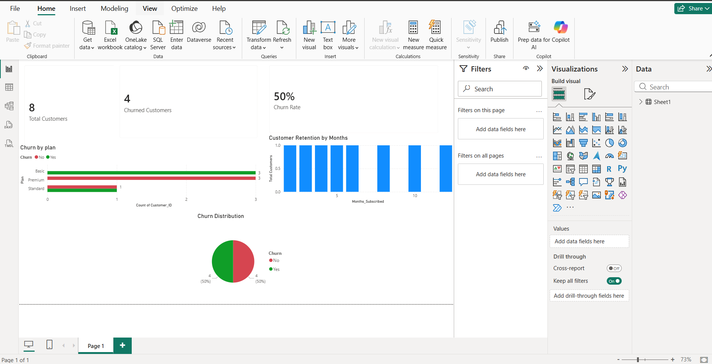

## 📊 Task 1: Business Sales Performance Analytics

This project analyzes business sales data to identify revenue trends, top-selling products, category performance, and regional sales performance.

## Tools Used
Microsoft Excel

## Dataset
The dataset includes the following fields:
- Order_ID
- Date
- Region
- Product
- Category
- Quantity
- Price
- Revenue

## Analysis Performed
- Revenue by Region
- Top Selling Products
- Category Performance
- Sales Trend Analysis

## Key Insights
- South region generates the highest revenue.
- Electronics category contributes the highest sales revenue.
- Phones are the most sold product.
- Accessories sell in higher quantity but generate lower revenue.

## Business Recommendations
- Increase marketing efforts for electronics products.
- Focus on improving sales performance in lower-performing regions.
- Offer bundle discounts to increase accessory sales.

## Author
Venkata Deepthi  
Data Science & Analytics Intern – Future Interns
## 📊 Task 2: Customer Churn Analysis (Power BI)

This project analyzes customer churn using Power BI dashboard.

### 🔧 Tools Used
- Microsoft Power BI

### 📁 Files
- FUTURE_DS_02_VenkataDeepthi_Churn_Analysis.pbix
- image.png

### 📊 Key Insights
- Basic plan has higher churn rate
- Premium plan retains more customers
- Customers churn mostly in early months
- Overall churn rate is 50%

### 📷 Dashboard Preview

## 📊 Task 3: Marketing Campaign Analysis Dashboard (Power BI)

## 📊 Project Overview
This project analyzes marketing campaign performance across different platforms like Facebook, Instagram, and Google Ads.

## 🔍 Key Metrics
- Total Spend
- Total Clicks
- Total Conversions
- CTR (Click Through Rate)
- Conversion Rate
- ROI

## 📈 Insights
- Google Ads generated the highest conversions
- Instagram showed moderate performance
- Facebook had lower conversion efficiency
- Higher spend resulted in higher conversions

## 🛠 Tools Used
- Power BI
- Excel

## 📁 Files Included
- Power BI Dashboard (.pbix)
- dashboard.png

## 📌 Author
Venkata Deepthi
